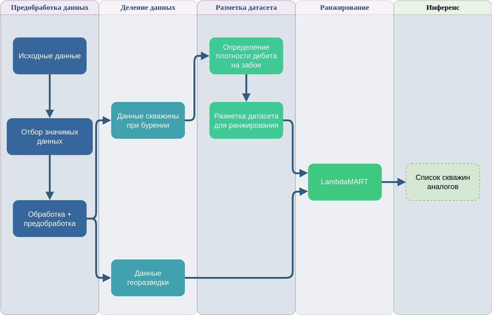

# Рекомендательная система для скважин

   


 


В рамках образовательной программы "Цифровые Методы в Энергетике" мы решили задачу посика скважин аналогов по предварительным данным на этапе георезведки.


Рекомендательная система для подбора скважин-аналогов в интегрированном моделировании активов важна для оптимизации ввода новых скважин. Ее основное предназначение заключается в том, чтобы на основе успешного опыта предыдущих проектов автоматизировать выбор наилучшего аналога скважины. Этот подход позволяет не только существенно сократить временные затраты, но и минимизировать риски, повышая вероятность успешного освоения новых месторождений за счет введения явных критериев подбора. В настоящий момент решения принимаются экспертно, что вносит большое влияние человеческого фактора. Таким образом, рекомендательная система для поиска аналоговых скважин является ключевым инструментом и обеспечивает более точное и надежное моделирование активов, способствуя устойчивой и успешной разработке активов Компании.

# Структура проекта

```bash
├── data                      # Directory for data-related files
│   ├── cleaned               # Cleaned data files
│   ├── processed             # Processed data files
│   └── raw                   # Raw data files
├── notebooks                 # Directory for Jupyter notebooks
│   ├── data.ipynb            # Notebook for data analysis
│   ├── similarity.ipynb      # Notebook for similarity analysis
│   └── well_relevant_example.ipynb  # Notebook for example analysis
├── reports                   # Directory for generated reports
└── src                       # Directory for source code
    ├── features              # Directory for feature-related code
    ├── models                # Directory for model-related code
    │   ├── metrics.py        # Metrics calculation script
    │   └── well_relevant.py  # Script for relevant model
    └── visualization         # Directory for visualization-related code
        └── visualization.py  # Script for visualization

```

# Паплайн проект



# Контакты

[Дмитрий Золотарев](https://t.me/dimkablin) - Университет ИТМО
[Егор Прокопов](https://t.me/egrneegr) - Университет ИТМО
[Александр Серов](https://t.me/thegoldian) - УРФУ
[Александр Майданцев](https://t.me/mayd01) - Университет Сириус